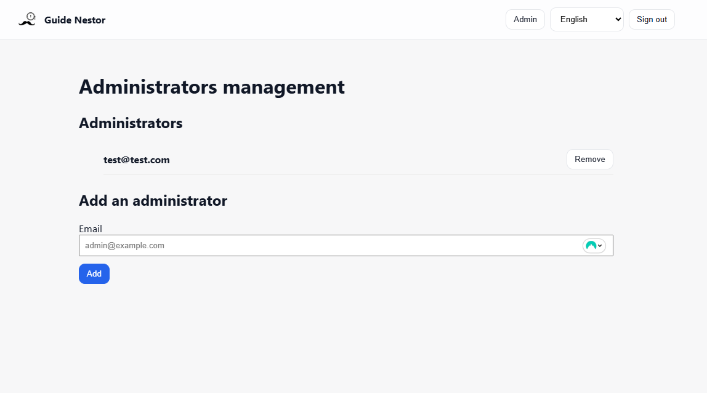

Administration
===============

In **Iris**, you have an administration view to help you.

By default, only the accounts with an email listed in the **api configuration parameter admin.defaultList** have access to this view.
Then, you can add other accounts through this view.

   *Administration view*

Actually, an admin can :

- **open/close ideas**

- **see closed ideas**