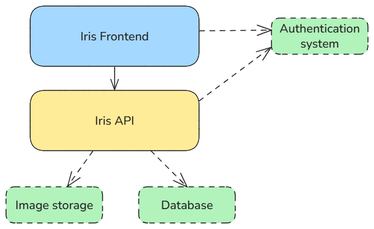

How does it work?
=================

   *Architecture of the iris service*

The Iris architecture is quite simple.

**Iris frontend** exposes the web application. It uses the authentication service to log in the user and validate the user token.
It also uses the Iris API to manage the ideas and other resources.

**Iris API** exposes all the methods to manage the data used by the frontend. It also uses the authentication service to validate
the user token. And it uses a database and image storage service to store all the data and informations.

----------

Supported authentication services
---------------------------------

Here is the current list of authentication services supported by Iris :

- `Firebase Authentication <https://firebase.google.com/docs/auth>`__

----------

Supported file storages
---------------------------------

Here is the current list of file storages supported by Iris :

- In the server hosting the API

----------

Supported databases
---------------------------------

Here is the current list of databases supported by Iris :

- MongoDB