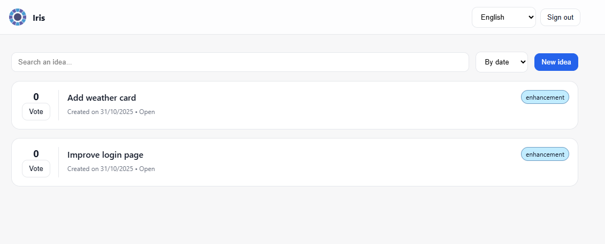
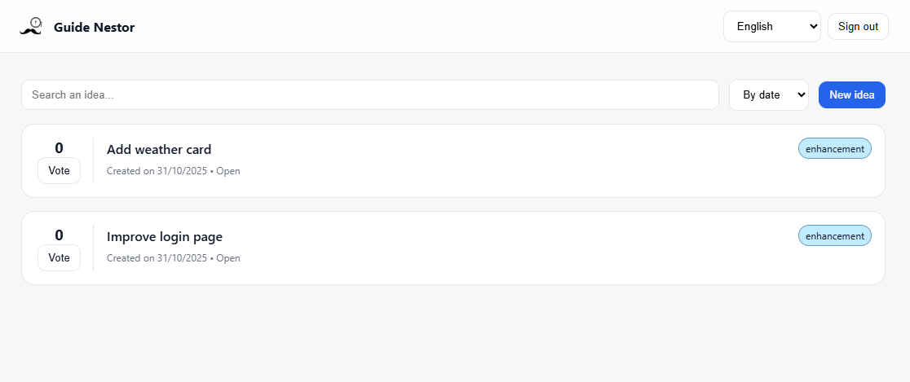

Introduction
============

**Iris** is a web application and an api to help you to get feedbacks from your users.

These feedbacks can be :

- **bug** - If a user wants to show an issue in the application
- **enhancement** - If a user wants to suggest a new feature or an improvement of an existing one

   *Homescreen once a user is logged in*

To make the feedback process easy and reusable for any kind of service or application, 2 things are done :

- **Customizable authentication** - To be able to reuse the same authentication as in your application
- **Customizable logo and title** - To let your user know that this platform is related to you, your company or your application

   *Customized Iris instance for the Guide Nestor application*

.. toctree::
   :hidden:
   :maxdepth: 2

   self
   architecture/architecture
   getting_started/index
   questions/questions
   contribute/contribute
   contribute/credits